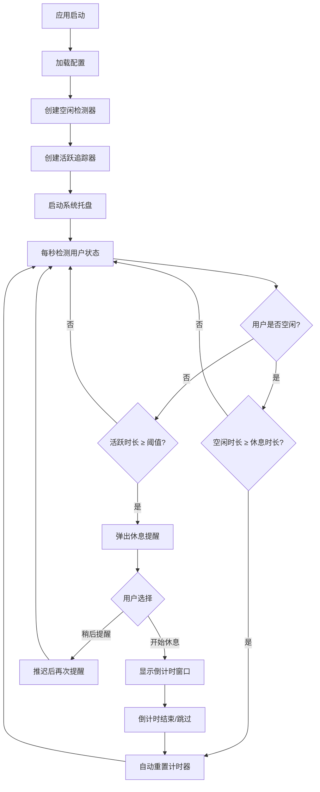

# 🫁 Breath - 屏幕休息提醒应用

Breath 是一款轻量级的桌面应用，帮助你在长时间使用电脑时定时休息，保护眼睛和身体健康。它运行在系统托盘中，智能检测用户活跃状态，在连续使用电脑达到设定时长后弹出休息提醒。

## ✨ 功能特性

- **智能活跃检测** — 通过系统级 API 检测用户输入（键盘/鼠标），精确追踪连续使用时长
- **空闲自动识别** — 当用户离开电脑一段时间后自动识别为空闲状态，空闲时长达到休息标准时自动重置计时
- **休息提醒弹窗** — 连续使用达到阈值时弹出友好的提醒窗口，显示已使用时长
- **休息倒计时** — 点击"开始休息"后进入倒计时界面，引导用户完成一次完整休息
- **推迟提醒** — 支持"稍后提醒"功能，推迟后会在设定间隔后再次提醒；多次推迟会显示健康警示
- **系统托盘常驻** — 在系统托盘中实时显示活跃时长和剩余时间，支持暂停/恢复追踪
- **可自定义配置** — 通过图形化设置界面调整各项参数
- **开机自启动** — 支持设置开机自动启动（macOS / Windows）
- **跨平台支持** — 支持 macOS 和 Windows

## 🏗️ 项目架构

```
breath/
├── cmd/breath/main.go          # 应用入口
├── assets/icons.go             # 应用图标（代码生成 PNG）
├── internal/
│   ├── autostart/              # 开机自启动（平台适配）
│   │   ├── autostart.go        #   接口定义
│   │   ├── autostart_darwin.go #   macOS: LaunchAgent plist
│   │   └── autostart_windows.go#   Windows: 注册表
│   ├── config/                 # 配置管理
│   │   ├── config.go           #   配置加载/保存/校验（JSON）
│   │   ├── config_darwin.go    #   macOS 配置路径
│   │   └── config_windows.go   #   Windows 配置路径
│   ├── detector/               # 用户空闲检测（平台适配）
│   │   ├── detector.go         #   接口定义
│   │   ├── detector_darwin.go  #   macOS: CGEventSource API
│   │   └── detector_windows.go #   Windows: GetLastInputInfo API
│   ├── timer/
│   │   └── tracker.go          # 活跃状态追踪器（核心逻辑）
│   ├── tray/
│   │   └── tray.go             # 系统托盘菜单管理
│   └── ui/
│       ├── manager.go          # UI 管理器
│       ├── reminder.go         # 休息提醒弹窗
│       ├── countdown.go        # 休息倒计时窗口
│       └── settings.go         # 设置窗口
├── Makefile                    # 构建脚本
├── go.mod
└── go.sum
```

### 核心工作流程



## ⚙️ 配置项

| 配置项 | 默认值 | 范围 | 说明 |
|--------|--------|------|------|
| 活跃时长阈值 | 45 分钟 | 15 - 120 分钟 | 连续使用多久后触发提醒 |
| 休息时长 | 5 分钟 | 1 - 30 分钟 | 每次休息的建议时长 |
| 空闲判定时长 | 5 分钟 | 1 - 15 分钟 | 无输入多久后判定为空闲 |
| 推迟提醒间隔 | 5 分钟 | 1 - 15 分钟 | 点击"稍后提醒"后多久再次提醒 |
| 开机自启动 | 关闭 | — | 是否开机自动启动 |

配置文件以 JSON 格式存储：
- **macOS**: `~/Library/Application Support/Breath/config.json`
- **Windows**: `%APPDATA%\Breath\config.json`

## 🚀 构建与运行

### 前置要求

- Go 1.25+
- CGO 支持（空闲检测依赖系统原生 API）
- macOS: Xcode Command Line Tools
- Windows: MinGW-w64（交叉编译时需要）

### 快速运行

```bash
make run
```

### 构建

```bash
# 构建当前平台
make build

# 构建 macOS 版本（amd64 + arm64）
make build-darwin

# 构建 Windows 版本
make build-windows

# 构建所有平台
make build-all
```

构建产物位于 `build/` 目录。

### 安装依赖

```bash
make deps
```

## 🛠️ 技术栈

- **语言**: Go
- **GUI 框架**: [Fyne](https://fyne.io/) v2 — 跨平台 Go GUI 工具包
- **空闲检测**:
  - macOS: `CoreGraphics` CGEventSource API
  - Windows: `GetLastInputInfo` Win32 API
- **系统托盘**: Fyne 内置 systray 支持
- **开机自启动**:
  - macOS: LaunchAgent plist
  - Windows: 注册表 `Run` 键

## 📄 License

MIT
